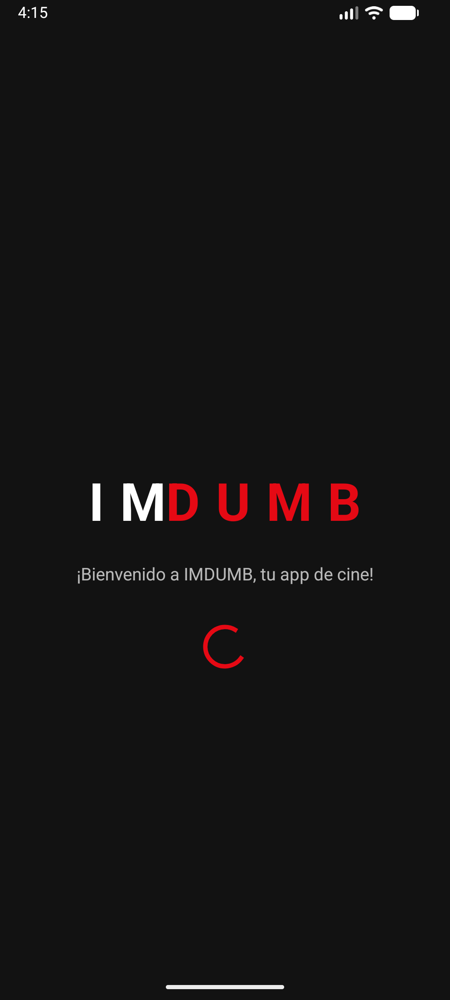
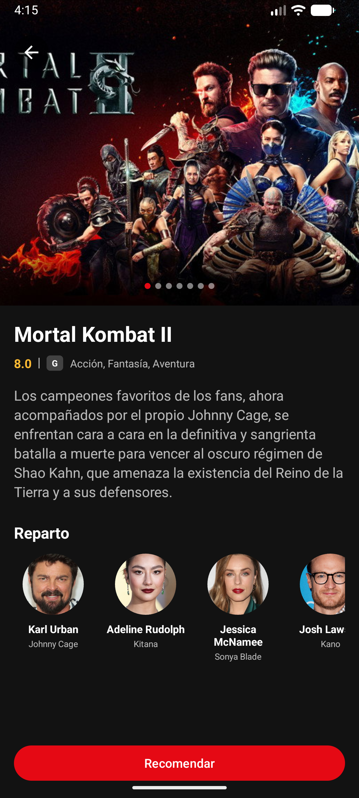
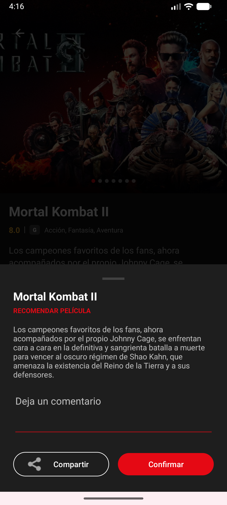
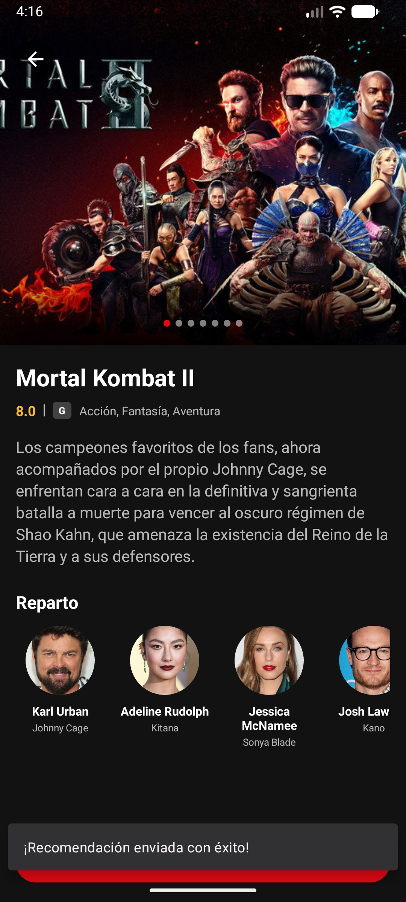

# IMDUMB 🎬

IMDUMB es una aplicación Android diseñada bajo los principios de **Clean Architecture** y el patrón **MVP**. El objetivo del proyecto es ofrecer un catálogo de películas consumiendo una API externa, garantizando una separación clara de responsabilidades y un alto rendimiento mediante programación reactiva.

## 📱 Preview

  
  
  
  
  

## 🚀 Características Técnicas
- **Arquitectura Single Activity:** Implementación de **Navigation Component** con **Safe Args** para una navegación centralizada y segura.
- **Optimización de Listados:** Uso de **ListAdapter y DiffUtil** en los RecyclerViews anidados para mejorar el rendimiento del scroll y la memoria.
- **Soporte Offline (Caché Local):** Persistencia de datos mediante **Room Database**, permitiendo la visualización del catálogo sin conexión a internet.
- **Configuración Dinámica:** Integración con **Firebase Remote Config** para el manejo de mensajes de bienvenida y control de funcionalidades (Feature Toggles).
- **Interfaz de Usuario:** Diseño en modo oscuro basado en **Material Design 3**, con carrusel de imágenes paginado y descripciones en formato HTML.
- **Procesamiento de Anotaciones:** Uso de **KSP** para optimizar los tiempos de compilación del proyecto.
- **Monitoreo:** Configuración base de **Firebase Crashlytics** y **Performance Monitoring**.

## 🏗️ Estructura del Proyecto
El proyecto está modularizado por Gradle para asegurar el desacoplamiento de las capas:

1.  **`:domain` (Kotlin Puro):** Contiene las reglas de negocio, entidades y definiciones de interfaces (abstracciones).
2.  **`:data` (Android Library):** Implementación de la infraestructura de datos. Orquesta las fuentes de datos remotas (**Retrofit**) y locales (**Room**).
3.  **`:app` (Presentation):** Capa de interfaz de usuario. Implementa el patrón **MVP** utilizando Fragments, ViewBinding y Hilt para la inyección de dependencias.

### Estrategia de Persistencia
Se utiliza **Room** para el almacenamiento de datos relacionales complejos (catálogo y géneros) y **SharedPreferences** para configuraciones de estado simple, buscando un equilibrio entre robustez y eficiencia.

## 🛠️ Tech Stack & Dependencias
- **Kotlin:** 2.0.21 | **Gradle:** 9.4.1 (AGP 8.7.3)
- **Inyección de Dependencias:** Hilt 2.55
- **Networking:** Retrofit 2.9.0 + OkHttp + Logging Interceptor
- **Reactividad:** RxJava 2 & RxKotlin 2.4.0
- **Persistencia:** Room 2.6.1 + SharedPreferences
- **UI:** Material Design 3, ViewPager2, ViewBinding
- **Pruebas:** MockK & JUnit

## 📐 Principios SOLID Implementados
- **SRP:** Responsabilidad única definida en cada Presenter y UseCase.
- **OCP:** Sistema de combinación de datos extensible para nuevas categorías.
- **LSP:** Implementación agnóstica de contratos de vista en los fragmentos.
- **ISP:** Interfaces de contratos segregadas por funcionalidad de pantalla.
- **DIP:** Dependencia de abstracciones definidas en la capa de dominio.

## ⚙️ Configuración y Ejecución
El proyecto está configurado para una **compilación inmediata** tras su clonación.

1.  **Entorno:** Se incluyen los archivos de configuración base para los servicios de Firebase y TMDb.
2.  **Requisitos:** Android Studio Ladybug (o superior) y JDK 17+.
3.  **Ambientes:** Soporte para 3 Product Flavors: `devDebug`, `qaDebug`, y `prodRelease`.

## 🧪 Pruebas
Se incluyen pruebas unitarias en el módulo `:domain` utilizando **MockK** para validar la lógica de los casos de uso y la orquestación reactiva.

---
Desarrollado por [Henry Arias](https://github.com/HAriasC).
